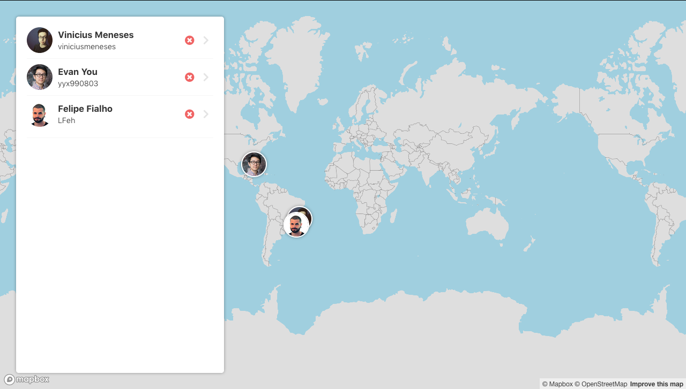

# map-github-users

> World map application to add Github users and find them.

It was developed using React and [Mapbox API](https://www.mapbox.com/) with the following libraries:

- [Redux](https://redux.js.org/)
- [Redux-Saga](https://redux-saga.js.org/)
- [Recompose](https://github.com/acdlite/recompose)
- [react-toastify](https://www.styled-components.com/)
- [react-map-gl](https://github.com/uber/react-map-gl)

[**Demo available here!**](http://map-github-users.surge.sh)

<p align="center">
  
</p>

## Using

First of all, you need to clone or download this repository.

```bash
git clone https://github.com/viniciusmeneses/map-github-users.git
```

Go to the **map-github-users** folder and install the dependencies

```bash
npm install
```

Create a `.env` file in **map-github-users** folder with *REACT_APP_MAPBOX* environment variable to set your Mapbox Token

```bash
REACT_APP_MAPBOX=YOUR_TOKEN_HERE
```

Run the following command to start using locally **map-github-users**:

```bash
npm start
```
